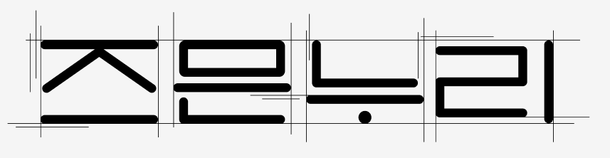

<p align="center">
  
  <h1 align="center">즈믄누리 (ZMNNOORY)</h1>
  <p align="center">
    <strong>"1000개의 얼굴, 1000개의 세계"</strong>
    <br />
    동양인 특화 AI 모델을 위한 고품질 안면 데이터 라벨링 플랫폼
    <br />
  </p>
</p>

<p align="center">
  
  
  
</p>

---

## 제가 기여한 내용은 frontend 폴더의 ReadMe에 기록되어있습니다. 이점 참고해주세요!! 해당 README는 FE, BE, INFRA 모든 것을 아우르는 공통 리드미입니다!!


## 📖 목차

1.  [**프로젝트 개요**](#1-프로젝트-개요)
2.  [**핵심 기능**](#2-핵심-기능)
3.  [**주요 사용자 (페르소나)**](#3-주요-사용자-페르소나)
4.  [**기술 스택 및 아키텍처**](#4-기술-스택-및-아키텍처)
5.  [**디렉토리 구조**](#5-디렉토리-구조)
6.  [**로컬 환경 설정**](#6-로컬-환경-설정)
7.  [**개발 문화 및 협업 규칙**](#7-개발-문화-및-협업-규칙)
8.  [**주간 공지 및 일정**](#8-주간-공지-및-일정)
9.  [**프로젝트 마일스톤**](#9-프로젝트-마일스톤)
10. [**팀원 소개**](#10-팀원-소개)
11. [**참고 문서**](#11-참고-문서)

---

## 1. 프로젝트 개요

### 문제 정의
현재 대다수의 AI 학습용 데이터는 서양인을 기준으로 구축되어 있습니다. 이로 인해 동양인을 대상으로 하는 AI 모델(얼굴 인식, 표정 분석 등)은 성능이 저하되는 심각한 데이터 편향성 문제를 겪고 있습니다. AI 기술의 공정성과 신뢰성을 확보하고, 아시아 시장에서 경쟁력 있는 서비스를 개발하기 위해서는 동양인에 특화된 고품질의 데이터셋이 절실히 필요합니다.

### 우리의 해결책
**즈믄누리(ZMNNOORY)** 는 게임화(Gamification) 방식을 도입하여 사용자가 재미를 느끼며 자신의 안면 데이터를 제공할 수 있는 플랫폼입니다. 우리는 이 과정을 통해 수집된 데이터를 정제하고 구조화하여, AI 모델의 편향성 문제를 해결하고자 하는 기업 및 연구 기관에 제공합니다. 궁극적으로는 누구나 신뢰할 수 있는 공정한 AI 개발 생태계를 만드는 데 기여하고자 합니다.

---

## 2. 핵심 기능

-   🎮 **스테이지 기반 데이터 수집**: 사용자는 웹캠을 통해 "도레미파솔라시도 말하기", "특정 표정 짓기", "시선으로 특정 지점 바라보기" 등 다양한 게임형 미션을 수행하며 자연스럽게 데이터를 제공합니다.
-   💰 **리워드 및 추천인 시스템**: 사용자는 미션 완료, 데이터 판매 시 수익 공유, 친구 추천 등 다양한 활동을 통해 보상을 획득하여 지속적인 참여 동기를 부여받습니다.
-   📊 **데이터 시각화 피드백**: 참여자는 자신의 데이터가 어떻게 수집되고 있는지 간단한 시각화 자료를 통해 피드백을 받을 수 있습니다.
-   🏢 **B2B 데이터 판매 및 툴 제공**: 기업 고객은 필요에 따라 정제된 데이터셋을 구매하거나, 데이터 수집 및 라벨링 툴 전체를 온프레미스(On-premise) 방식으로 도입할 수 있습니다.
-   🔐 **데이터 주권 보장**: 사용자는 데이터 삭제 API 및 UI를 통해 원할 때 언제든지 자신의 데이터를 관리하고 삭제할 권한을 가집니다.

---

## 3. 주요 사용자 (페르소나)

### **(B2C) 데이터 제공자**

| 페르소나 | 특징 | 니즈 |
| :--- | :--- | :--- |
| **대학생/취준생** (20-29세) | 리워드에 민감하고, 신기술 경험에 긍정적임. | 간편하게 참여하여 용돈을 벌고 싶어하며, 개인정보의 안전한 처리를 원함. |
| **기술 호기심형 일반인** (25-40세) | AI 기술과 윤리에 관심이 많음. | 사회적 가치를 지닌 프로젝트에 참여하고 싶어하며, 데이터 사용의 투명성과 삭제 권한 보장을 중요하게 생각함. |

### **(B2B) 데이터 수요자**

| 페르소나 | 특징 | 니즈 |
| :--- | :--- | :--- |
| **AI 스타트업** | 딥러닝 기반 얼굴/표정/시선 인식 모델을 개발함. | 동양인 데이터 부족으로 인한 모델 성능 저하 문제를 해결하기 위해, 구조화된 고품질 동양인 데이터셋을 필요로 함. |
| **의료/헬스케어 기업** | 안면 근육 분석 기반의 진단 서비스를 개발함. | 특정 조건(질환, 표정 등)에 맞는 데이터셋을 확보하고 싶어하며, 데이터 수집의 윤리적/법적 이슈 해결을 원함. |

---

## 4. 기술 스택 및 아키텍처

| 구분 | 기술 |
| :--- | :--- |
| **프론트엔드** | Vue.js or React |
| **백엔드** | Spring Boot |
| **데이터 처리** | Python, MediaPipe, OpenCV |
| **데이터베이스** | MongoDB (비정형 데이터), AWS S3 (파일 스토리지) |
| **인증/보안** | OAuth 2.0, HTTPS, JWT, 데이터 암호화 |

---

## 5. 디렉토리 구조
```
.
├── backend
│   ├── build.gradle
│   └── src
│       └── main
│           ├── java
│           │   └── com
│           │       └── zmnnoory
│           │           ├── ZmnnooryApplication.java
│           │           ├── domain
│           │           ├── controller
│           │           ├── service
│           │           └── repository
│           └── resources
│               ├── application.yml
│               ├── static
│               └── templates
├── frontend
│   ├── public
│   │   └── index.html
│   ├── src
│   │   ├── assets
│   │   ├── components
│   │   ├── views
│   │   ├── router
│   │   ├── store
│   │   └── App.vue
│   ├── package.json
│   └── vue.config.js
├── docs
│   └── convention.md
└── README.md
```

---

## 6. 로컬 환경 설정

```bash
# 1. 원격 저장소를 복제합니다.
$ git clone [https://lab.ssafy.com/s13-webmobile1-sub1/S13P11A302.git](https://lab.ssafy.com/s13-webmobile1-sub1/S13P11A302.git)

# 2. 프로젝트 디렉토리로 이동합니다.
$ cd S13P11A302

# 3. develop 브랜치를 생성하고 이동합니다.
$ git checkout -b develop

# 4. 원격 develop 브랜치의 내용을 가져옵니다.
$ git pull origin develop

# 5. 프론트엔드/백엔드 디렉토리에서 필요한 패키지를 설치합니다.
# (각 디렉토리의 README 참조)
$ npm install # or yarn install
$ ./gradlew build # 빌드는 예시

# 6. 프로젝트를 실행합니다.
$ npm run serve # or yarn serve
$ ./gradlew bootRun # 빌드는 예시
```

---

## 7. 개발 문화 및 협업 규칙

우리 팀은 효율적이고 일관된 협업을 위해 다양한 개발 컨벤션을 수립하여 Notion에 정리하고 있습니다.  
모든 팀원은 아래 문서를 참조하여 규칙을 준수해 주세요.

### 📚 컨벤션 문서 모음 (Notion)

| 문서명 | 링크 |
|--------|------|
| 🧾 Git 커밋 컨벤션 | [Notion 링크](https://wirehaired-objective-39b.notion.site/232232dbe36c808fa470c28265e36c2c?pvs=143) |
| ☕ 자바 코드 컨벤션 | [Notion 링크](https://wirehaired-objective-39b.notion.site/232232dbe36c80aab3d8e4c1a45a8a44?source=copy_link) |
| 📌 Jira 컨벤션 | [Notion 링크](https://wirehaired-objective-39b.notion.site/233232dbe36c80d08fe2da9b02b9eb1d?source=copy_link) |
| 🗂 Vue 디렉토리 컨벤션 | [Notion 링크](https://wirehaired-objective-39b.notion.site/Vue-233232dbe36c809c81aadbdfc5851858?source=copy_link) |
| 📜 자바스크립트 컨벤션 | [Notion 링크](https://wirehaired-objective-39b.notion.site/234232dbe36c808695a3c95425936eac?source=copy_link) |

> 🔗 최신 문서는 항상 Notion에서 확인해주세요. README는 요약 정보만 제공됩니다.


---

## 8. 주간 공지 및 일정

> 💡 **Note:** 본 섹션은 팀의 빠른 정보 공유를 위해 마련되었습니다. 최신 정보는 팀 노션 페이지 또는 메타모스트 채널을 확인해주세요.

-   **금주 주요 일정**:
    -   `2025-07-14 (월)`: 2주차 스프린트 계획 회의 (오전 10시)
    -   `2025-07-16 (수)`: 아이디어 구체화 및 MVP 설계 시작
    -   `2025-07-18 (금)`: 주간 회고 및 차주 계획 논의 (오후 5시)
-   **공지 사항**:
    -   `2025-07-21 (월)`부터는 본격적인 개발이 시작될 예정입니다. FE, BE에 맞춰서 API 설계 부탁드립니다.

---

## 9. 프로젝트 마일스톤

| 주차 | 목표 |
| :--: | :--- |
| **1주차** | AI 부트캠프 (공통 교육 및 프로젝트 준비) |
| **2주차** | 아이디어 확정 및 MVP 설계 (컨벤션 정립, 아이디어 구체화 포함) |
| **3주차** | MVP 구현 |
| **4주차** | 기획 산출물 정리 및 MVP 구현 지속 |
| **5주차** | MVP를 포함한 서비스 기능 고도화 |
| **6주차** | 서비스 발표 준비 |
| **7주차** | 발표 및 피드백 |

---


## 10. 팀원 소개

### 🧠 Backend

|  | 이름 | 역할 | 주요 담당 업무 | GitHub |
|:-:|:---:|:---:|:---|:---:|
|  | **이우진** | 백엔드 |  | [@lebind12](https://github.com/lebind12) |
|  | **김정규** | 백엔드 |  | [@kimregular](https://github.com/kimregular) |
|  | **김광현** | 백엔드 |  | [@kimgwang-hyeon](https://github.com/kimgwang-hyeon) |


### 🎨 Frontend

|  | 이름 | 역할 | 주요 담당 업무 | GitHub |
|:-:|:---:|:---:|:---|:---:|
|  | **정태승** | 프론트엔드 |  | [@fluetanol](https://github.com/fluetanol) |
|  | **손동현** | 프론트엔드 |  | [@SonDongHyeon](https://github.com/SonDongHyeon) |
|  | **박시우** | 프론트엔드 |  | [@psiudo](https://github.com/psiudo) |


---

## 11. 참고 문서

| 문서명 | 설명 | 링크 |
|--------|------|------|
| 📋 요구사항 명세서 | 주요 기능 요구사항 정의서 | [바로가기](https://wirehaired-objective-39b.notion.site/233232dbe36c8059ac4ed98899365a91?source=copy_link) |
| 🖼️ 와이어프레임 | 서비스 화면 구성 시안 | [바로가기](https://wirehaired-objective-39b.notion.site/233232dbe36c8027906beb040b217b5a?source=copy_link) |
| 🔌 API 명세서 | 백엔드 API 엔드포인트 명세 | [바로가기](https://wirehaired-objective-39b.notion.site/BE-API-234232dbe36c8069b9e8c6ed428045fb?source=copy_link) |

