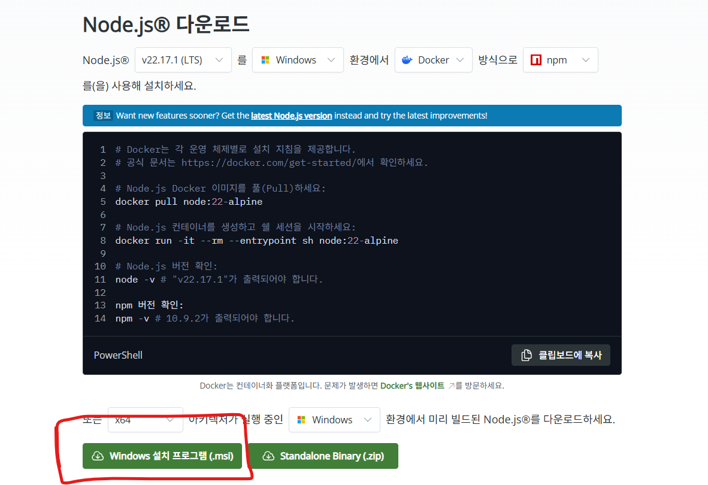
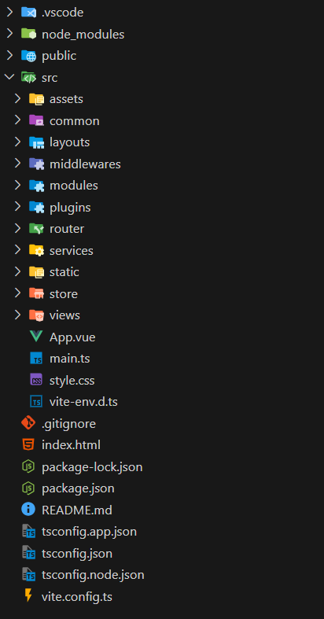

프론트 리드미 입니다.
# FE README

## 프로젝트 셋팅 가이드
### 필수 설치
1. [Node.js](https://nodejs.org/ko) 설치, 22.17.1(LTS) 통일 권장


2. 깃 클론하기

```bash 
git clone https://lab.ssafy.com/s13-webmobile1-sub1/S13P11A302.git
```

3. VS code 디렉토리는 ```\frontend\zmnoory``` 로 맞춰놓으면 됨.


### 프로젝트 실행 테스트
1. VS code의 디렉토리를 \ZMNOORY로 맞추고
2. VS code 터미널을 킨 뒤 (Ctrl + `)
3. ```npm run dev```입력

>  만약 nodejs를 설치 한 후에도 npm이 실행이 안된다면 powershell말고 cmd를 터미널로 사용하세요 

### 디렉토리 구조 참고
```src/
├── assets/                # 정적 자산
├── common/                # 공통 컴포넌트, 헬퍼, 상수 등
├── layouts/               # 페이지 레이아웃
├── middlewares/          # 라우터 가드 등 중간 처리 로직
├── modules/              # 도메인/기능 단위 모듈
├── plugins/              # 외부 라이브러리 등록
├── router/               # vue-router 설정
├── services/             # API 통신 로직
├── static/               # 정적 파일 (Vite public과 유사)
├── store/                # 전역 상태관리 (Pinia/Vuex 등)
├── views/                # 라우터 기반 페이지 컴포넌트
├── App.vue               # 루트 컴포넌트
├── main.ts               # 앱 진입점
```

